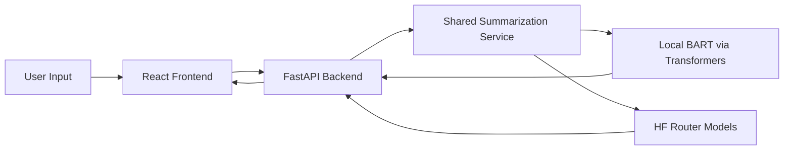
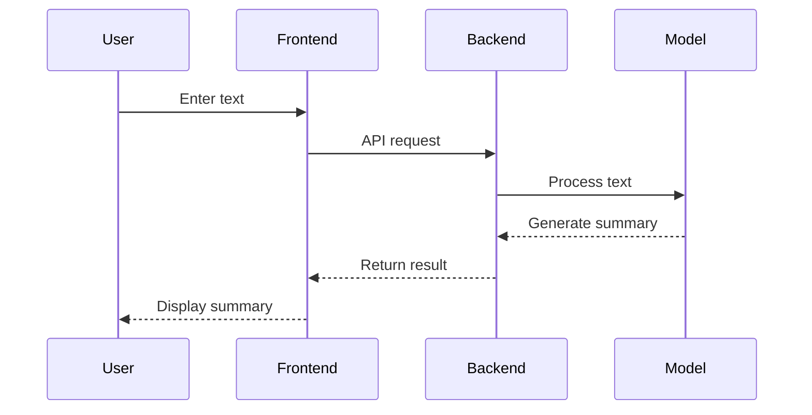

<!-- ================= HEADER ================= -->

<h1 align="center">
  InsightAI ⚡</h1>

<p align="center">
  <i>From raw text → to intelligent insights!</i>
</p>

<p align="center">
  
</p>

<p align="center">
  
  
  
</p>

<p align="center">
  
</p>

---

<!-- ================= FEATURES ================= -->

## ✦ Features

<div align="center">

| Feature              | Description                                                |
| -------------------- | ---------------------------------------------------------- |
| Smart Summarization  | Converts long text into concise insights                   |
| Length Control       | Short / Medium / Long / Bullet / Key insight modes         |
| Fast API             | FastAPI backend with a shared inference interface          |
| Model Comparison     | BART vs Mistral vs T5 vs Pegasus                           |
| Clean UI             | Responsive frontend for summarization and model comparison |
| Export Tools         | Copy / Download summaries                                  |

</div>

---

<!-- ================= ARCHITECTURE ================= -->

## 🏗️ Architecture



---

<!-- ================= WORKFLOW ================= -->

## ⚙️ How It Works



---

<!-- ================= MODELS ================= -->

## 🤖 AI Models

| UI Label | Model ID                          | Call Type |
| -------- | --------------------------------- | --------- |
| BART     | `facebook/bart-large-cnn`         | Runs locally using HuggingFace `transformers` |
| Mistral  | `meta-llama/Llama-3.3-70B-Instruct` | Hugging Face router chat-completions |
| T5       | `sshleifer/distilbart-cnn-12-6`   | Hugging Face router text2text-generation slot |
| Pegasus  | `google/pegasus-cnn_dailymail`    | Hugging Face router summarization |

Notes:
- BART runs locally.
- On first run, if BART is not already present in the local HuggingFace cache, the backend downloads it automatically.
- Mistral, T5, and Pegasus are remote calls and require a user-provided Hugging Face token.
- UI labels stay fixed as `BART`, `Mistral`, `T5`, and `Pegasus` even though the underlying router-backed models are selected for live compatibility.

---

<!-- ================= TECH STACK ================= -->

## 🧩 Tech Stack

<p align="center">
  
</p>

- Frontend: React + Vite
- Backend: FastAPI
- Local model runtime: HuggingFace `transformers` + PyTorch for BART
- Remote model runtime: Hugging Face router via `httpx`
- Configuration: shared model registry in `Frontend/src/config/models.json`

---

<!-- ================= API ================= -->

## 🔗 API Endpoints

### ✧ Summarize

```http
POST /api/summarize
```

```json
{
  "text": "Your text...",
  "summary_type": "short",
  "model": "facebook/bart-large-cnn"
}
```

Supported `model` values:
- `facebook/bart-large-cnn`
- `meta-llama/Llama-3.3-70B-Instruct`
- `sshleifer/distilbart-cnn-12-6`
- `google/pegasus-cnn_dailymail`

---

### ✧ Compare Models

```http
POST /api/compare
```

```json
{
  "text": "Your text...",
  "summary_type": "short"
}
```

---

<!-- ================= INSTALL ================= -->

## 🚀 Installation

### Environment Variables

Create `Backend/.env` with:

```env
HUGGINGFACE_API_KEY=your_token_here
```

Notes:
- `HUGGINGFACE_API_KEY` is required for Mistral, T5, and Pegasus.
- BART does not require the API key.
- The backend also accepts `HUGGINGFACE_API_TOKEN`, `HF_TOKEN`, and `HUGGINGFACEHUB_API_TOKEN`.

---

### Backend

```bash
cd Backend
python -m venv venv
venv\Scripts\activate
pip install -r requirements.txt
uvicorn app.main:app --reload
```

First-time setup notes:
- On first BART request, HuggingFace may download `facebook/bart-large-cnn` into the local cache if it is not already present.
- Keep your internet connection available for the first BART download and for all remote model calls.

---

### Frontend

```bash
cd Frontend
npm install
npm run dev
```

---

### Run Locally

1. Start the backend from `Backend/`.
2. Start the frontend from `Frontend/`.
3. Open the Vite URL shown in the terminal, usually `http://localhost:5173`.
4. Use the dashboard or compare page to generate summaries.

The frontend proxies `/api/*` requests to the FastAPI backend during local development.

---

<!-- ================= FUTURE ================= -->

## 🌌 Roadmap

* Real-time analytics dashboard
* Multi-language summarization
* Cloud deployment
* Authentication system

---

<!-- ================= AUTHOR ================= -->

## 🧑‍💻 Author

**Vidhi**
AI/ML Developer

---

<p align="center">
  
</p>