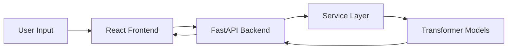
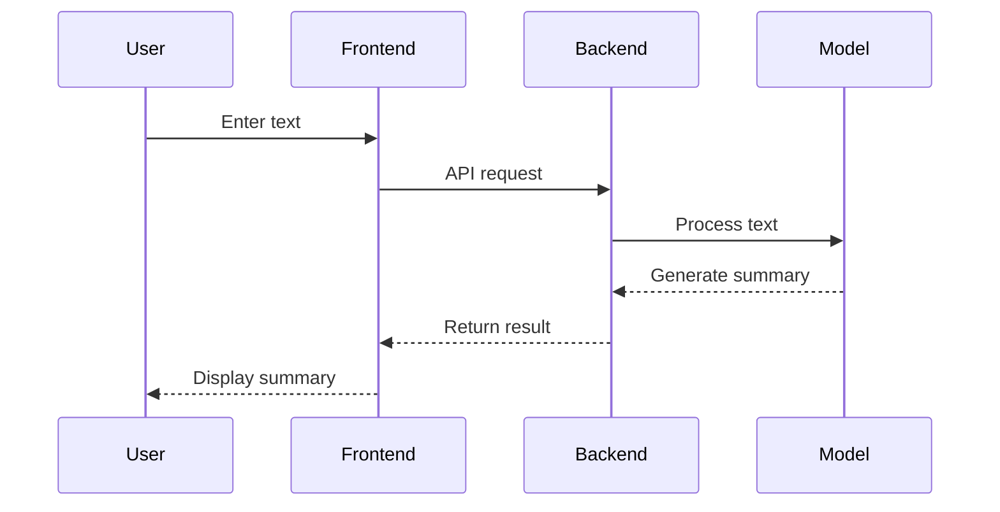

<!-- ================= HEADER ================= -->

<h1 align="center">
 𝙸𝚗𝚜𝚒𝚐𝚑𝚝𝙰𝙸 ⚡</h1>

<p align="center">
  <i>From raw text → to intelligent insights!</i>
</p>

<p align="center">
  
</p>

<p align="center">
  
  
  
</p>

<p align="center">
  
</p>

---


<!-- ================= FEATURES ================= -->

## ✦ 𝙁𝙚𝙖𝙩𝙪𝙧𝙚𝙨

<div align="center">

| 🚀 Feature             | 💡 Description                           |
| ---------------------- | ---------------------------------------- |
| 🧠 Smart Summarization | Converts long text into concise insights |
| 🎚️ Length Control     | Short / Medium / Long summaries          |
| ⚡ Fast API             | Optimized FastAPI backend                |
| 🔄 Model Comparison    | BART vs T5 vs Pegasus                    |
| 🎨 Clean UI            | Responsive modern interface              |
| 📋 Export Tools        | Copy / Download summaries                |

</div>

---

<!-- ================= ARCHITECTURE ================= -->

## 🏗️ 𝘼𝙧𝙘𝙝𝙞𝙩𝙚𝙘𝙩𝙪𝙧𝙚



---

<!-- ================= WORKFLOW ================= -->

## ⚙️ 𝙃𝙤𝙬 𝙄𝙩 𝙒𝙤𝙧𝙠𝙨



---

<!-- ================= MODELS ================= -->

## 🤖 𝘼𝙄 𝙈𝙤𝙙𝙚𝙡𝙨

| Model      | Strength                   |
| ---------- | -------------------------- |
| 🧠 BART    | High-quality summarization |
| ⚡ T5       | Fast & flexible            |
| 📰 Pegasus | News-style summaries       |

---

<!-- ================= TECH STACK ================= -->

## 🧩 𝙏𝙚𝙘𝙝 𝙎𝙩𝙖𝙘𝙠

<p align="center">
  
</p>

---

<!-- ================= API ================= -->

## 🔗 𝘼𝙋𝙄 𝙀𝙣𝙙𝙥𝙤𝙞𝙣𝙩𝙨

### ✧ Summarize

```http
POST /api/summarize
```

```json
{
  "text": "Your text...",
  "type": "short"
}
```

---

### ✧ Compare Models

```http
POST /api/compare
```

---

<!-- ================= INSTALL ================= -->

## 🚀 𝙄𝙣𝙨𝙩𝙖𝙡𝙡𝙖𝙩𝙞𝙤𝙣

### Backend

```bash
cd Backend
python -m venv venv
venv\Scripts\activate
pip install -r requirements.txt
uvicorn app.main:app --reload
```

---

### Frontend

```bash
cd Frontend
npm install
npm run dev
```

---


---

<!-- ================= FUTURE ================= -->

## 🌌 𝙍𝙤𝙖𝙙𝙢𝙖𝙥

* 📊 Real-time analytics dashboard
* 🌍 Multi-language summarization
* ☁️ Cloud deployment
* 🔐 Authentication system

---

<!-- ================= AUTHOR ================= -->

## 🧑‍💻 𝘼𝙪𝙩𝙝𝙤𝙧

**Vidhi** ✨
🚀 AI/ML Developer | Building real-world intelligent systems

---

<p align="center">
  
</p>

<p align="center">
  ⭐ <b>Star this repo to support the project</b> ⭐
</p>
