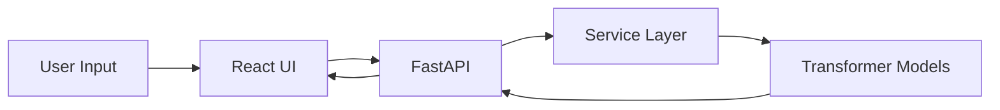

<h1 align="center">
  𝙄𝙣𝙨𝙞𝙜𝙝𝙩𝘼𝙄 ✨
</h1>

<p align="center">
  <i>Transform long text into meaningful intelligence using AI</i>
</p>

<p align="center">
  
  
  
</p>

<p align="center">
  
</p>

---

## ✦ 𝙒𝙝𝙖𝙩 𝙞𝙨 𝙄𝙣𝙨𝙞𝙜𝙝𝙩𝘼𝙄?

> A modern AI-powered platform that converts lengthy text into concise, meaningful summaries using state-of-the-art transformer models.

---

## ⚡ 𝙁𝙚𝙖𝙩𝙪𝙧𝙚𝙨

✧ 🧠 Intelligent summarization using NLP
✧ 🎚️ Adjustable summary length (Short / Medium / Long)
✧ ⚡ High-performance FastAPI backend
✧ 🔄 Multi-model comparison (BART / T5 / Pegasus)
✧ 🎨 Clean and responsive UI
✧ 📋 Copy & download summaries

---

## 🏗️ 𝘼𝙧𝙘𝙝𝙞𝙩𝙚𝙘𝙩𝙪𝙧𝙚



---

## 🧠 𝘼𝙄 𝙈𝙤𝙙𝙚𝙡𝙨

* facebook/bart-large-cnn
* google/t5-small
* google/pegasus-xsum

---

## ⚙️ 𝙏𝙚𝙘𝙝 𝙎𝙩𝙖𝙘𝙠

| Layer       | Stack                    |
| ----------- | ------------------------ |
| 🎨 Frontend | React + Tailwind         |
| ⚙️ Backend  | FastAPI                  |
| 🤖 AI       | HuggingFace Transformers |
| 📄 Docs     | Swagger UI               |

---

## 🚀 𝙂𝙚𝙩𝙩𝙞𝙣𝙜 𝙎𝙩𝙖𝙧𝙩𝙚𝙙

### ✧ Backend

```bash
cd Backend
python -m venv venv
venv\Scripts\activate
pip install -r requirements.txt
uvicorn app.main:app --reload
```

---

### ✧ Frontend

```bash
cd Frontend
npm install
npm run dev
```

---

## 🔗 𝘼𝙋𝙄

### ✧ Summarize

```http
POST /api/summarize
```

```json
{
  "text": "Your text...",
  "type": "short"
}
```

---

## 📊 𝙎𝙖𝙢𝙥𝙡𝙚 𝙊𝙪𝙩𝙥𝙪𝙩

```json
{
  "summary": "AI is transforming industries by enabling automation..."
}
```

---

## 🌌 𝙁𝙪𝙩𝙪𝙧𝙚 𝙑𝙞𝙨𝙞𝙤𝙣

✧ 📊 Model performance dashboard
✧ 🌍 Multi-language support
✧ ☁️ Cloud deployment
✧ 🔐 User authentication

---

## 🧑‍💻 𝘼𝙪𝙩𝙝𝙤𝙧

**Vidhi** ✨
AI/ML Enthusiast | Builder of intelligent systems

---

<p align="center">
  
</p>

<p align="center">
  <b>⭐ Star this repo if you liked it</b>
</p>
